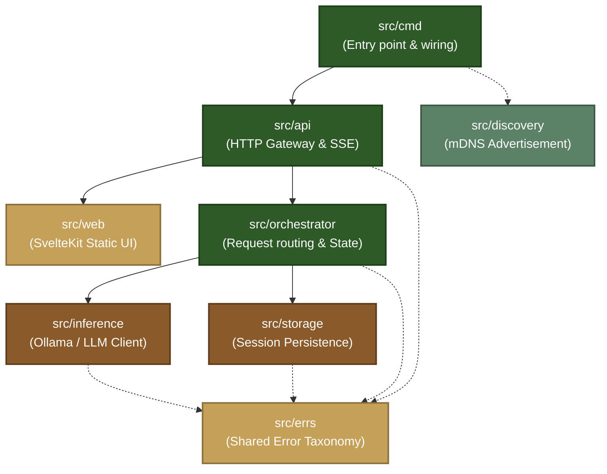

<p align="center">
  
</p>

<h1 align="center">Linden</h1>

<p align="center">
  <em>A Home AI Solution. The AI you can trust, because you own it.</em>
</p>

<p align="center">
  <a href="LICENSE"></a>
  <a href="https://golang.org"></a>
  <a href="https://kit.svelte.dev"></a>
  <a href="https://www.docker.com"></a>
</p>

---

Linden is a privacy-first, local AI platform built in Go and SvelteKit. It runs on hardware you own, on your own local network, and interacts with local language models without cloud dependencies, external telemetry, or data retention.

See [AGENTS.md](AGENTS.md) for agentic engineering workflows and contributor conventions.

## Key Technical Design Principles

- **Provably Private & Zero-Leakage**: Architecture enforces privacy, not just policy. No user content leaves the local network; zero user data in logs at any level (including debug); error messages returned to clients are strictly sanitized.
- **Strict Layered Seams & Shared Kernel**: One-way dependencies (`cmd` &rarr; `api` &rarr; `orchestrator` &rarr; `inference` / `storage`). Leaf layers remain isolated. Error taxonomy is published in `src/errs` (a stdlib-only shared kernel).
- **Contract-First Delivery**: Architectural interfaces are defined as normative contracts and verified via contract tests (`validation/contracts/`) before any implementation code merges.
- **Single Binary Deployment with Embedded UI**: SvelteKit frontend builds to static assets embedded directly into the Go binary (`embed.FS`), serving both the responsive web client and Server-Sent Events (SSE) streaming endpoints.
- **Linux & Container Parity**: Linux is the authoritative deployment target with strict parity enforced across Docker and CI gates.

---

## Architecture Navigation Hub

Linden is organized into discrete architectural layers with strict interface boundaries:



### Documentation Index

| Domain | Focus | Key Documents |
|--------|-------|---------------|
| **Architecture & Interfaces** | Internal seams, wire contracts, and runtime design | &bull; [Layer Interface Specification](docs/architecture/layer-interface-spec.md)<br>&bull; [System Architecture](docs/architecture/system_design.md)<br>&bull; [Architecture Decision Records (ADRs)](docs/adr/) |
| **Product & Specifications** | Observable guarantees, user flows, and capabilities | &bull; [Product Spec Overview](docs/product/spec/00-overview.md)<br>&bull; [API Surface Specification](docs/product/spec/40-api-surface.md)<br>&bull; [PRD-0001: Local Chat](docs/product/prd/0001-local-chat.md) |
| **Engineering & Practices** | Standards, testing policy, and agent frameworks | &bull; [Contract-First Delivery](docs/project/contract-first-delivery.md)<br>&bull; [Branching Strategy](docs/project/branching-strategy.md)<br>&bull; [Agentic Workflow Framework](docs/project/agentic-workflow-framework.md)<br>&bull; [AGENTS.md](AGENTS.md) |
| **Roadmap & Delivery** | Stage-by-stage implementation plans | &bull; [Implementation Sequence](plans/04-implementation-sequence.md)<br>&bull; [Stage 0: Groundwork](plans/05-stage-0-groundwork.md) |

---

## Quick Start

### Prerequisites

| Tool | Required Version | Purpose |
|------|------------------|---------|
| Go | 1.22+ | Backend server runtime |
| Node.js | 20+ | Frontend client build |
| Ollama | Current | Local inference backend (with a pulled model, e.g. `qwen2.5` or `tinyllama`) |
| Docker | Current | Containerized deployment and runtime validation gate |

### Running Locally

```sh
# 1. Check local toolchain
./scripts/setup.sh

# 2. Build SvelteKit frontend and Go server
make build

# 3. Start Linden (serves on :8080)
./bin/linden
```

Verify the operational endpoints:

```sh
curl http://localhost:8080/health    # {"status":"ok"}
curl http://localhost:8080/version   # build metadata
```

### Running with Docker

Run the containerized server against your local Ollama instance:

```sh
# Host Ollama, containerized Linden
OLLAMA_URL=http://host.docker.internal:11434 docker compose up --build
```

To run runtime smoke checks:

```sh
make docker-smoke
```

---

## Platform Support Matrix

| Platform | Role | Notes |
|----------|------|-------|
| **Linux** | Deployment target | The authoritative runtime; all CI gates run here |
| **Docker (Linux)** | Deployment vehicle | Container deployment; verified via container smoke gate |
| **Windows** | Development host | Supported via VS Code devcontainer |
| **macOS** | Development host | Supported via native toolchain or devcontainer |

See [ADR-0003: Target Platform Policy](docs/adr/0003-target-platform-policy.md) and [ADR-0002: Role of Docker in Distribution](docs/adr/0002-role-of-docker-in-distribution.md).

---

## Contributor Instructions

We welcome contributions! Please review [CONTRIBUTING.md](CONTRIBUTING.md) before submitting pull requests.

### Core Development Rules

1. **Contract-First Testing**: Contract tests in `validation/contracts/` assert against [Layer Interface Specification](docs/architecture/layer-interface-spec.md) and must precede or accompany layer implementation.
2. **Table-Driven Tests**: Every layer exports unit tests utilizing Go table-driven testing patterns (`Test_FunctionName_Scenario_Expected`).
3. **Strict Privacy**: Never write user content to logs (even at debug level) or include sensitive info in client error responses.
4. **Branching & Commits**: One branch per PR (`feat/`, `fix/`, `test/`, `docs/`, `chore/`). Use Conventional Commits.

### Running Local Gates

Before submitting a PR, verify local gates:

```sh
make lint                                                    # go vet + svelte-check
cd src && go test -race ./...                                # unit tests
cd validation && go test -tags=contracts -race ./contracts/... # contract tests
cd validation && go test -tags=integration -race ./integration/... # integration tests
make docker-smoke                                            # container smoke check
```

---

## Security

Please report vulnerabilities privately. See [SECURITY.md](SECURITY.md) for disclosure guidelines.

## License

Licensed under the [Business Source License 1.1](LICENSE). Free for personal, home, evaluation, and privacy-auditing use, converting to GNU GPL v2.0 or later after four years. Commercial or for-profit use requires a separate commercial license.


