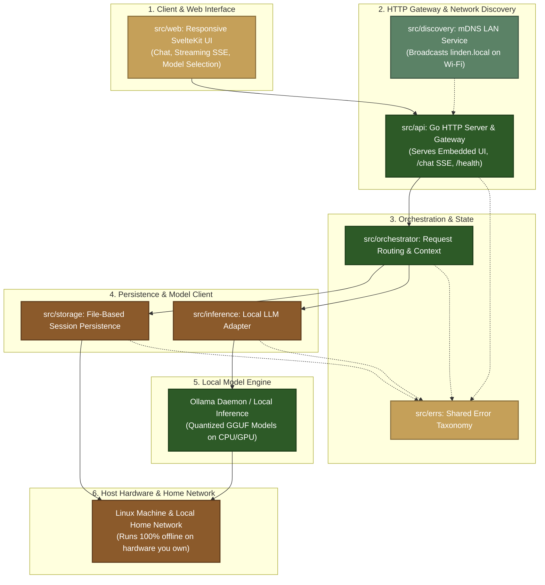

<p align="center">
  
</p>

<h1 align="center">Linden</h1>

<p align="center">
  <em>A Home AI Solution. The AI you can trust, because you own it.</em>
</p>

<p align="center">
  <a href="LICENSE"></a>
  <a href="https://golang.org"></a>
  <a href="https://golang.org"></a>
  <a href="https://kit.svelte.dev"></a>
  <a href="https://www.docker.com"></a>
</p>

---

Linden is a self-contained, local AI appliance built for Linux. It runs directly on your local network hardware, serving chat completions and streaming responses using locally running language models. With zero external cloud dependencies, no tracking, and fully auditable source code, Linden gives you a personal assistant that you control completely.

See [AGENTS.md](AGENTS.md) for agentic engineering workflows and contributor conventions.

## Key Design Principles

- **Local & Source-Auditable**: Runs entirely on your own local hardware without external cloud services or telemetry. The source is open to audit so you can inspect exactly what runs on your network. No user chat content is ever recorded in logs at any level, and error messages are strictly sanitized.
- **Single-Binary Full-Stack Deployment**: The SvelteKit frontend compiles to static assets embedded directly into the Go server binary (`embed.FS`). Running a single binary serves both the responsive web UI and the streaming API.
- **Zero-Config LAN Discovery**: Automatically advertises `linden.local` across your home Wi-Fi via mDNS, allowing any phone, laptop, or tablet on your network to connect without manual IP configuration.
- **Clean Layered Architecture**: Strict one-way layer seams (`cmd` &rarr; `api` &rarr; `orchestrator` &rarr; `inference` / `storage`) with isolated leaf layers and a standard shared error taxonomy.
- **Contract-First Reliability**: Layer interfaces are defined as explicit contracts and validated with automated contract suites before implementation merges.

---

## Quick Start & Easy Onboarding

Turn any Linux machine into a private home AI assistant in minutes.

### Prerequisites

- **Linux** (native or containerized)
- **Ollama** installed with a pulled model (e.g. `ollama run qwen2.5` or `ollama run tinyllama`)
- **Go 1.22+** & **Node.js 20+** (or simply **Docker**)

### Option A: Run Directly (Native Linux)

```sh
# 1. Verify your local toolchain
./scripts/setup.sh

# 2. Build the embedded full-stack binary
make build

# 3. Start Linden (serves on port 8080)
./bin/linden
```

### Option B: Run with Docker

```sh
# Run containerized Linden connected to your host Ollama
OLLAMA_URL=http://host.docker.internal:11434 docker compose up --build
```

### Access & Use

Once started, Linden is ready to use immediately:

1. **In your browser**: Open **`http://localhost:8080`** (on the host) or **`http://linden.local:8080`** from any device on your local Wi-Fi.
2. **Start chatting**: Send a message to receive real-time streamed responses generated entirely by your local model.
3. **Verify health**:
   ```sh
   curl http://localhost:8080/health    # {"status":"ok"}
   curl http://localhost:8080/version   # build metadata
   ```

---

## Architecture Navigation Hub

Linden is structured as a top-to-bottom stack, moving from the user interface down to the underlying local hardware:



### Documentation Index

| Domain | Focus | Key Documents |
|--------|-------|---------------|
| **Architecture & Interfaces** | Layer seams, wire contracts, and system design | &bull; [Layer Interface Specification](docs/architecture/layer-interface-spec.md)<br>&bull; [System Architecture](docs/architecture/system_design.md)<br>&bull; [Architecture Decision Records (ADRs)](docs/adr/) |
| **Product Specifications** | Observable guarantees, API contracts, and user flows | &bull; [Product Spec Overview](docs/product/spec/00-overview.md)<br>&bull; [API Surface Specification](docs/product/spec/40-api-surface.md)<br>&bull; [PRD-0001: Local Chat](docs/product/prd/0001-local-chat.md) |
| **Engineering & Practices** | Development workflow, testing standards, and agent rules | &bull; [Contract-First Delivery](docs/project/contract-first-delivery.md)<br>&bull; [Branching Strategy](docs/project/branching-strategy.md)<br>&bull; [Agentic Workflow Framework](docs/project/agentic-workflow-framework.md)<br>&bull; [AGENTS.md](AGENTS.md) |

---

## Contributor Instructions

We welcome contributions! Please review [CONTRIBUTING.md](CONTRIBUTING.md) before submitting pull requests.

### Core Development Rules

1. **Contract-First Testing**: Interface contracts must have tests in `validation/contracts/` that assert against the [Layer Interface Specification](docs/architecture/layer-interface-spec.md) before or alongside implementation.
2. **Table-Driven Tests**: All Go packages utilize table-driven testing patterns (`Test_FunctionName_Scenario_Expected`).
3. **Strict Privacy**: Never write user chat data to logs or expose internal error traces to client responses.
4. **Branching & Commits**: One branch per PR (`feat/`, `fix/`, `test/`, `docs/`, `chore/`). Use Conventional Commits.

### Running Local Gates

Before submitting a PR, verify local gates:

```sh
make lint                                                      # go vet + svelte-check
cd src && go test -race ./...                                  # unit tests
cd validation && go test -tags=contracts -race ./contracts/...   # contract tests
cd validation && go test -tags=integration -race ./integration/... # integration tests
make docker-smoke                                              # container runtime check
```

---

## Security

Please report vulnerabilities privately. See [SECURITY.md](SECURITY.md) for disclosure guidelines.

## License

Licensed under the [Business Source License 1.1](LICENSE). Free for personal, home, evaluation, and privacy-auditing use, converting to GNU GPL v2.0 or later after four years. Commercial or for-profit use requires a separate commercial license.


