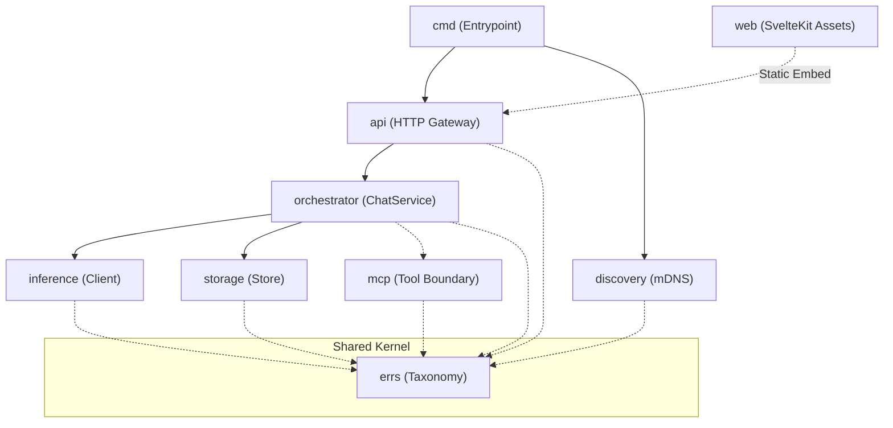

# Linden Layer Interface Specification

## Status
Accepted & Active Architectural Specification.

## Purpose
This document provides the authoritative architectural overview of Linden's runtime layers, the strict one-way dependency model, and the interface boundaries separating each subsystem. It serves as the primary index and architectural guide for the dedicated, table-driven technical specifications located in [`docs/architecture/interfaces/`](interfaces/).

## Scope
This specification defines the runtime boundaries and contracts for:
1. `src/cmd/` — Entrypoint & wiring
2. `src/api/` — HTTP Gateway & OpenAI compatibility
3. `src/orchestrator/` — Conversational context & coordination
4. `src/inference/` — Local LLM provider abstraction
5. `src/storage/` — Session persistence & data storage
6. `src/discovery/` — Local network mDNS advertisement
7. `src/mcp/` — Extensibility & Model Context Protocol boundary
8. `src/errs/` — Shared error taxonomy kernel
9. `src/web/` — SvelteKit user interface build artifact

---

## Architectural Invariants

1. **One-Way Dependencies:** Dependencies are strictly hierarchical and follow layer order. Circular or reverse dependencies are forbidden.
2. **Interface Decoupling:** Consumers depend exclusively on exported Go interfaces (`ChatService`, `Client`, `Store`, `Advertiser`), never on concrete struct implementations.
3. **Contract-First Testing:** Every layer interface must have an isolated conformance suite under `validation/contracts/` asserting compliance against its normative specification before code merges.
4. **Shared Kernel Rule:** A package imported across multiple layers without restriction must be a logic-free, dependency-free shared kernel. Currently, `src/errs` is the only approved shared kernel (see [`docs/adr/0004-shared-error-taxonomy.md`](../adr/0004-shared-error-taxonomy.md)).
5. **Strict Privacy Boundary:** User conversational data, message bodies, and internal system stack traces must never appear in logs or error bodies returned to clients.
6. **Linux & Container Parity:** All interfaces, builds, and validation tests must execute deterministically across Linux CI and local Docker containers.

---

## Dependency Topology

### Layer Architecture Graph



### Import Rules Matrix

| Layer | May Import | Must Never Import |
|---|---|---|
| **`cmd/`** | `api`, `orchestrator`, `inference`, `storage`, `discovery`, `config`, `errs` | None (it is the root composer) |
| **`api/`** | `orchestrator`, `config`, `errs` | `inference`, `storage`, `discovery`, `mcp`, `cmd` |
| **`orchestrator/`** | `inference`, `storage`, `mcp`, `config`, `errs` | `api`, `cmd`, `discovery`, `web` |
| **`inference/`** | `errs`, stdlib | `api`, `orchestrator`, `storage`, `cmd` |
| **`storage/`** | `errs`, stdlib | `api`, `orchestrator`, `inference`, `cmd` |
| **`discovery/`** | `errs`, stdlib (or approved mDNS library) | `api`, `orchestrator`, `inference`, `storage`, `cmd` |
| **`mcp/`** | `errs`, stdlib | `api`, `orchestrator`, `inference`, `storage`, `cmd` |
| **`errs/`** | stdlib only | Any layer in `src/` |
| **`web/`** | Standalone Node/SvelteKit | Go source code |

---

## Layer Interface Catalog

Detailed method signatures, payload schemas, concurrency rules, and error matrices are maintained in individual normative technical specifications in [`interfaces/`](interfaces/):

| Layer | Interface / Boundary | Role & Primary Responsibility | Primary Consumer | Normative Technical Specification |
|---|---|---|---|---|
| **`api`** | HTTP Gateway & Handlers | Exposes REST & SSE endpoints, request validation, 1MB payload limits, and OpenAI translation. | Web Client, External LAN Tools | [`interfaces/api-gateway.md`](interfaces/api-gateway.md) |
| **`orchestrator`** | `orchestrator.ChatService` | Manages conversational state, session retrieval, inference dispatch, and token streaming callbacks. | `api` layer | [`interfaces/orchestrator-service.md`](interfaces/orchestrator-service.md) |
| **`inference`** | `inference.Client` | Encapsulates LLM backend communication (Ollama), token chunk streaming, and context cancellation. | `orchestrator` layer | [`interfaces/inference-client.md`](interfaces/inference-client.md) |
| **`storage`** | `storage.Store` | Atomic filesystem session persistence, message retrieval, and deterministic data purging. | `orchestrator` layer | [`interfaces/storage-store.md`](interfaces/storage-store.md) |
| **`discovery`** | `discovery.Advertiser` | Advertises Linden's presence on the LAN via mDNS (`linden.local`) on port 8080. | `cmd` layer | [`interfaces/discovery-advertiser.md`](interfaces/discovery-advertiser.md) |
| **`mcp`** | Tool Boundary | Sandboxed subprocess execution for Model Context Protocol tools with strict privacy guardrails. | `orchestrator` layer | [`interfaces/mcp-boundary.md`](interfaces/mcp-boundary.md) |
| **`errs`** | Shared Kernel | Defines the closed error taxonomy and uniform error wrapping primitives for all layers. | All Layers | [`interfaces/error-taxonomy.md`](interfaces/error-taxonomy.md) |
| **`web`** | User Interface | SvelteKit static single-page application providing responsive local chat, served directly by `api`. | End User Browser | Standalone build in `src/web/` |
| **`cmd`** | Application Entrypoint | Wires concrete layer implementations, binds OS signals, and oversees clean process shutdown. | OS Runtime | `src/cmd/main.go` |

---

## Shared Error Taxonomy

All internal errors cross layer boundaries using the published error taxonomy defined in `src/errs` (normative spec: [`interfaces/error-taxonomy.md`](interfaces/error-taxonomy.md)).

### Error Code Enum

The taxonomy is a closed, stable set of codes:

| Code | Semantic Meaning | Recommended HTTP Status |
|---|---|---|
| `invalid_argument` | Client specified an invalid argument (empty messages, missing required fields, payload >1MB). | `400 Bad Request` |
| `unauthenticated` | Request does not have valid authentication credentials for the operation. | `401 Unauthorized` |
| `permission_denied` | Caller does not have permission to execute the specified operation. | `403 Forbidden` |
| `not_found` | A requested resource (model, session) was not found. | `404 Not Found` |
| `conflict` | Resource conflict or concurrency update failure. | `409 Conflict` |
| `resource_exhausted` | Quota exceeded, host storage full, or memory limits reached. | `429 Too Many Requests` / `507 Insufficient Storage` |
| `unavailable` | Upstream service (e.g. Ollama daemon) is temporarily unreachable or starting up. | `502 Bad Gateway` / `503 Service Unavailable` |
| `deadline_exceeded` | Operation timed out before completion. | `504 Gateway Timeout` |
| `internal` | Unrecoverable internal failure; unclassified system errors default here. | `500 Internal Server Error` |

### Error Handling Rules

1. **Context Wrapping:** Layers must always wrap errors using `errs.Wrap(code, msg, err)` to preserve causality without dropping codes.
2. **Code Preservation:** If an underlying error already contains an `errs.Code`, upper layers preserve it unless intentionally reclassifying.
3. **No User Content:** Error strings must describe operational failure modes (e.g. `"failed to load session: not found"`) and must never interpolate user messages or prompt text.
4. **Client Sanitization:** At the API boundary, internal error messages are mapped to standardized client-safe responses.

---

## Cross-Cutting Execution Semantics

### 1. Concurrency & Goroutine Safety
- All interface implementations (`ChatService`, `Client`, `Store`, `Advertiser`) must be safe for concurrent access by multiple goroutines.
- Streaming callbacks (`onChunk func(Chunk) error`) are invoked **synchronously and sequentially** on the caller's goroutine. The caller does not need mutexes inside the callback.

### 2. Context Cancellation Precedence
- Every blocking or streaming method accepts a `context.Context` as its first parameter.
- Implementations check `ctx.Err()` prior to invoking external network calls or delivering chunks.
- If a context is canceled by the client, cancellation takes strict precedence over downstream transport errors (e.g., returning `context.Canceled` rather than `unavailable`).

### 3. Idempotency & Clean Resource Lifecycle
- Background services (`Advertiser`, server listeners) must implement idempotent `Start()` and `Stop()` methods.
- Calling `Stop()` on an already-stopped service returns `nil`.

---

## Contract Conformance & Drift Detection

To guarantee that code and architecture never diverge, two automated quality gates enforce conformance:

1. **Contract Test Verification:**
   - Isolated black-box contract tests in `validation/contracts/` verify that implementations honor their respective interface contracts under success, error, timeout, and cancellation conditions.
   - Run locally and in CI:
     ```sh
     go test -tags=contracts ./validation/contracts/...
     ```

2. **Automated AST Drift Detection (`tools/docgen`):**
   - The Go AST inspection utility parses all interfaces in `src/` and asserts that every exported method and error code exists in the corresponding specification document in `docs/architecture/interfaces/`.
   - Run locally and in CI:
     ```sh
     cd tools && go run ./docgen -verify
     ```
